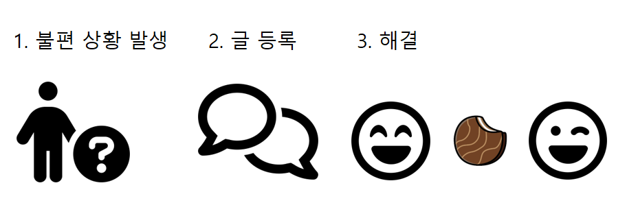

# 프로젝트 Choco-Buy

프로젝트 명 : Choco-Buy [(링크 / 2022.07.29까지)](http://chocobuy250.ml:8080/)    
프로젝트 기간 : 2022/04/04 - 2022/05/11 (월-금 09:30 - 18:20)  

팀명 : 도와조  
팀원 : [김혜린](https://github.com/gimae1) [민성호](https://github.com/Hernameis) [민지홍](https://github.com/may-jh) 신예정 [심현정](https://github.com/jwsimhj97) [이혜미](https://github.com/Flowerdrumsong) [장우혁](https://github.com/dgh03052) 최재현   

|                    이름                     |          포지션 및 담당 파트           |                 기타                  |
| :-----------------------------------------: | :------------------------------------: | :-----------------------------------: |
|     [김혜린](https://github.com/gimae1)     |         부팀장, Trade(게시글)          |              페이지 통합              |
|   [민성호](https://github.com/Hernameis)    |          팀장, Admin(관리자)           | 서비스 호스팅, 깃허브 관리, 파일 통합 |
|     [민지홍](https://github.com/may-jh)     |               Pay(결제)                |                                       |
|                   신예정                    |               Chat(채팅)               |                                       |
|   [심현정](https://github.com/jwsimhj97)    |           Inquiry(1:1 문의)            |    CSS 통합, DB 테이블 유효성 관리    |
| [이혜미](https://github.com/Flowerdrumsong) |     Join(회원가입), Login(로그인)      |   kakao map, I'm port 결제 api 사용   |
|    [장우혁](https://github.com/dgh03052)    | Service(고객센터), Qna(자주 묻는 질문) |                                       |
|                   최재현                    |          Mypage(마이 페이지)           |          도로명주소 api 사용          |


## :eyes: 개요

> 생활 속의 크고 작은 불편함을,   
> 이웃과 함께 해결할 수 있는  공간




## 🛠 주요 기술 스택

            

|    이름     |       버전       | 기술, 버전 선택 이유                                        |
| :---------: | :--------------: | :---------------------------------------------------------- |
|    JAVA     |        8         | 실무에서 가장 많이 쓰이는 버전                              |
|   SPRING5   | 5.1.16 -> 5.1.22 | 보안 이슈 (5.1.22)                                          |
| 아파치 톰캣 |       9.0        | 하위 버전에서는 EL(Expression Language) 문법 일부 적용 안됨 |

### 

## 🗺️ 서비스 구조


클라이언트 요청 -> WAS (컨트롤러 -> DB 접근 -> jsp) -> 클라이언트 응답 (이미지로 대체)


## :airplane: 페이지 소개

### 1. 회원가입 / 로그인

<details>
    <summary>회원가입 페이지</summary>
    <div markdown="1">


</details>

<details>
    <summary>로그인 페이지</summary>
    <div markdown="1">


</details>

### 2. 게시글

<details>
    <summary>거래 페이지</summary>
    <div markdown="1">


</details>

### 3. 채팅

<details>
    <summary>채팅 페이지</summary>
    <div markdown="1">


</details>

### 4. 결제

<details>
    <summary>결제 페이지</summary>
    <div markdown="1">


</details>

### 5. 마이 페이지

<details>
    <summary>마이 페이지</summary>
    <div markdown="1">


</details>

### 6. 1:1 문의

<details>
    <summary>1:1 문의 페이지</summary>
    <div markdown="1">


</details>

### 7. 고객센터 / 자주 묻는 질문

<details>
    <summary>고객센터 페이지</summary>
    <div markdown="1">


</details>

### 8. 관리자 페이지

<details>
    <summary>관리자 페이지</summary>
    <div markdown="1">


</details>


## :file_folder: 디렉토리 구조

```
└─src
    └─main
        ├─java
        │  └─com
        │      ├─chocobuy
        │      │  ├─biz
        │      │  │  ├─admin
        │      │  │  │  └─impl
        │      │  │  ├─chat
        │      │  │  │  └─impl
        │      │  │  ├─inquiry
        │      │  │  │  └─impl
        │      │  │  ├─pay
        │      │  │  │  └─impl
        │      │  │  ├─qna
        │      │  │  │  └─impl
        │      │  │  ├─service
        │      │  │  │  └─impl
        │      │  │  ├─trade
        │      │  │  │  └─impl
        │      │  │  ├─user
        │      │  │  │  └─impl
        │      │  │  └─util
        │      │  └─view
        │      │      └─controller
        │      └─my
        │          └─web
        │              └─interceptor
        ├─resources
        │  └─mappings
        └─webapp
            ├─resources
            │  ├─css
            │  ├─img
            │  │  ├─ban
            │  │  ├─common
            │  │  ├─profileImg
            │  │  ├─serviceImg
            │  │  └─upload
            │  └─js
            └─WEB-INF
                ├─config
                └─views
                    ├─Admin
                    ├─Chat
                    ├─error
                    ├─Inquiry
                    ├─Join
                    ├─Login
                    ├─Mypage
                    ├─Pay
                    ├─popup
                    ├─Service
                    ├─template
                    └─Trade
```
