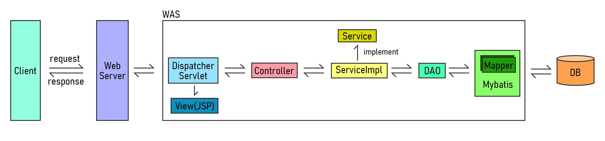
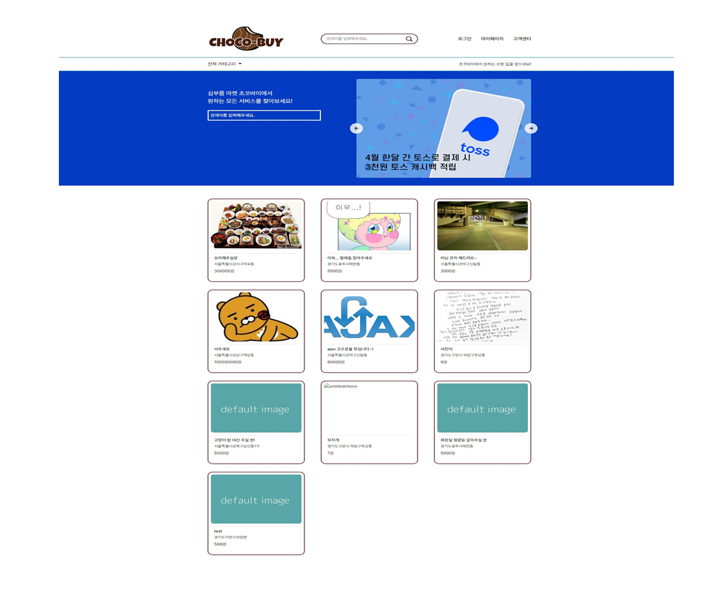
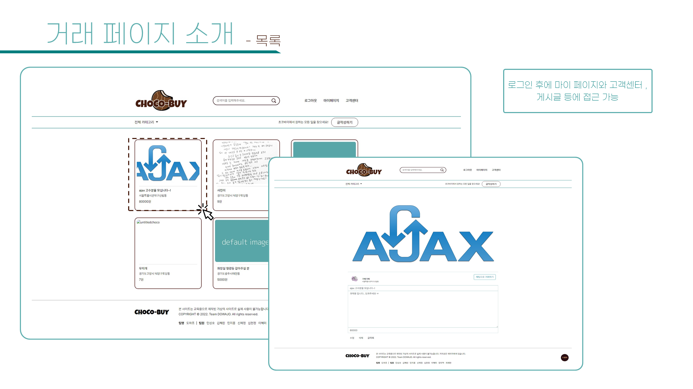
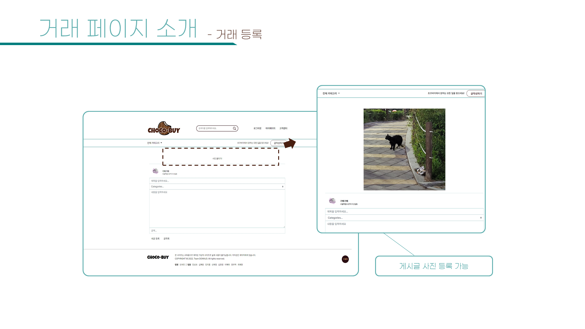
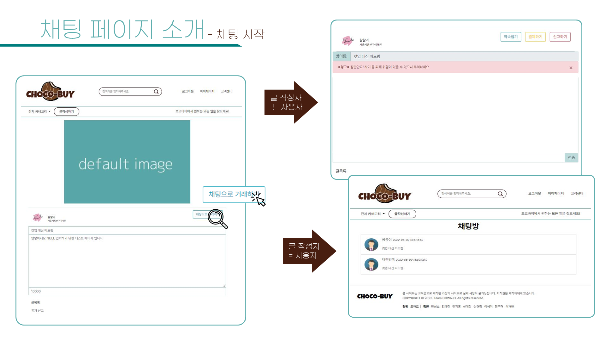
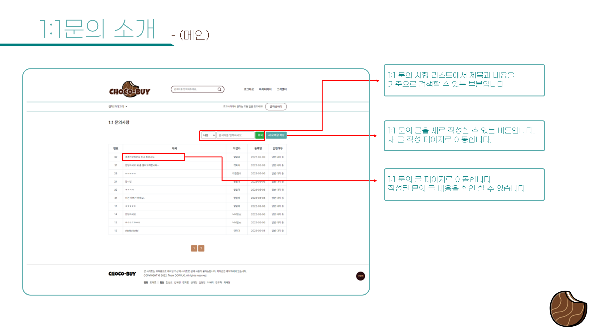
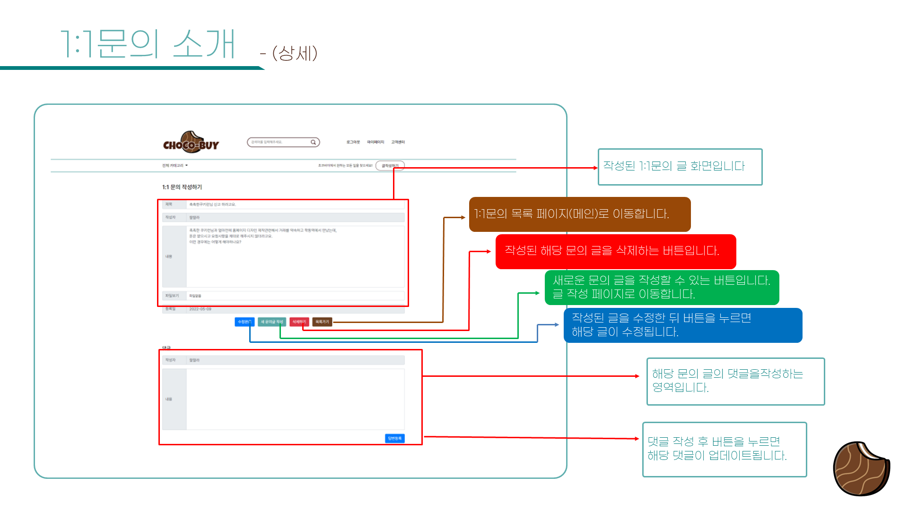

# 프로젝트 Choco-Buy

프로젝트 명 : Choco-Buy [(링크 / 2022.07.29까지 호스팅)](http://chocobuy250.ml:8080/)    
프로젝트 기간 : 2022/04/04 - 2022/05/11 (월-금 09:30 - 18:20)  

팀명 : 도와조  
팀원 : [김혜린](https://github.com/gimae1) [민성호](https://github.com/Hernameis) [민지홍](https://github.com/may-jh) 신예정 [심현정](https://github.com/jwsimhj97) [이혜미](https://github.com/Flowerdrumsong) [장우혁](https://github.com/dgh03052) 최재현

|                    이름                     |          포지션 및 담당 파트           |                 기타                  |
| :-----------------------------------------: | :------------------------------------: | :-----------------------------------: |
|     [김혜린](https://github.com/gimae1)     |         부팀장, Trade(게시글)          |              페이지 통합              |
|   [민성호](https://github.com/Hernameis)    |          팀장, Admin(관리자)           | 서비스 호스팅, 깃허브 관리, 파일 통합 |
|     [민지홍](https://github.com/may-jh)     |               Pay(결제)                |   kakao map, I'm port 결제 api 활용   |
|                   신예정                    |               Chat(채팅)               |                                       |
|   [심현정](https://github.com/jwsimhj97)    |           Inquiry(1:1 문의)            |    CSS 통합, DB 테이블 유효성 관리    |
| [이혜미](https://github.com/Flowerdrumsong) |     Join(회원가입), Login(로그인)      |     coolsms, 도로명주소 api 활용      |
|    [장우혁](https://github.com/dgh03052)    | Service(고객센터), Qna(자주 묻는 질문) |                                       |
|                   최재현                    |          Mypage(마이 페이지)           |          도로명주소 api 활용          |

## :eyes: 개요

> 생활 속의 크고 작은 불편함을,   
> 이웃과 함께 해결할 수 있는  공간

## 🛠 주요 기술 스택

        
      

|    이름     |       버전       | 기술, 버전 선택 이유                                        |
| :---------: | :--------------: | :---------------------------------------------------------- |
|    JAVA     |        8         | 실무에서 가장 많이 쓰이는 버전                              |
|   SPRING5   | 5.1.16 -> 5.1.22 | 보안 취약점 이슈                                            |
| 아파치 톰캣 |       9.0        | 하위 버전에서는 EL(Expression Language) 문법 일부 적용 안됨 |

## 🗺️ 서비스 구조

## :file_folder: 디렉토리 구조

    
디렉토리 상세

    

      └─src
        └─main
            ├─java
            │  └─com
            │      ├─chocobuy
            │      │  ├─biz
            │      │  │  ├─admin
            │      │  │  │  └─impl
            │      │  │  ├─chat
            │      │  │  │  └─impl
            │      │  │  ├─inquiry
            │      │  │  │  └─impl
            │      │  │  ├─pay
            │      │  │  │  └─impl
            │      │  │  ├─qna
            │      │  │  │  └─impl
            │      │  │  ├─service
            │      │  │  │  └─impl
            │      │  │  ├─trade
            │      │  │  │  └─impl
            │      │  │  ├─user
            │      │  │  │  └─impl
            │      │  │  └─util
            │      │  └─view
            │      │      └─controller
            │      └─my
            │          └─web
            │              └─interceptor
            ├─resources
            │  └─mappings
            └─webapp
                ├─resources
                │  ├─css
                │  ├─img
                │  │  ├─ban
                │  │  ├─common
                │  │  ├─profileImg
                │  │  ├─serviceImg
                │  │  └─upload
                │  └─js
                └─WEB-INF
                    ├─config
                    └─views
                        ├─Admin
                        ├─Chat
                        ├─error
                        ├─Inquiry
                        ├─Join
                        ├─Login
                        ├─Mypage
                        ├─Pay
                        ├─popup
                        ├─Service
                        ├─template
                        └─Trade

## :airplane: 페이지 소개

    
메인 페이지

    

    
회원가입/로그인 페이지

    

    
거래 페이지

    

    
채팅 페이지

    

    
결제 페이지

    

    
마이 페이지

    

    
1:1 문의 페이지

    

    
고객센터 페이지

    

    
관리자 페이지

    

    
반응형

    

## 품질 테스트 및 피드백

품질 테스트 주체 : 학원 강사, 다른 팀

    
피드백 상세

    

| 주제 | 담당파트 / 담당자 | 내용 |
| ---- | ----------------- | ---- |
|      |                   |      |

## :hammer: 업데이트 (프로젝트 종료 이후)

|    날짜    |    분류     |                          변경 사항                           |
| :--------: | :---------: | :----------------------------------------------------------: |
| 2022.05.13 | 마이페이지  |  자신과 관련있는 거래글의 리뷰만 작성, 조회 가능하도록 수정  |
| 2022.05.13 | 결제 페이지 | 1. 모바일 결제 기능 정상화 (메인 PG사 이니시스->다날) 2. 결제 취소 기능 구현 (관리자 페이지에 버튼 추가) 3. 거래 완료시 구매자 정보가 DB에 입력됨 (마이페이지에서 조회 가능)  |

## :date: 다음 업데이트 예정

|       분류       |                         추가할 내용                          |
| :--------------: | :----------------------------------------------------------: |
| 회원가입 페이지  |               현재 위치 잡기, 랜덤 별명 생성기               |
|  로그인 페이지   |                   자동 로그인, 간편 로그인                   |
|  거래글 페이지   |                   거래 상세 페이지 UI 개선                   |
| 리뷰 입력 페이지 |                     상대방에게 알림기능                      |
|   채팅 페이지    | 약속잡기 주소 API 사용 , 채팅창 말풍선 디자인, 결제 여부 확인 후 결제하기 버튼 만료 |
|   결제 페이지    |                    결제수단별 PG사 다양화                    |
| 고객센터 페이지  |          메뉴바 디자인,  공지사항 상세페이지 디자인          |
| 1:1 문의 페이지  |           1대1 문의 목록 페이지 테이블 디자인 변경           |
|  관리자 페이지   | 접속 시간 등 클라이언트 요청마다 로그 파일에 누적시키기. 필요없는 주석, 출력문 제거 |

